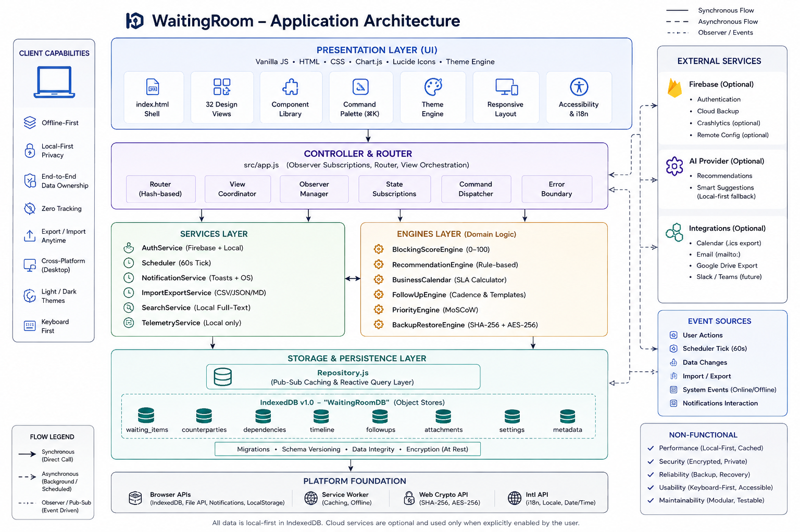
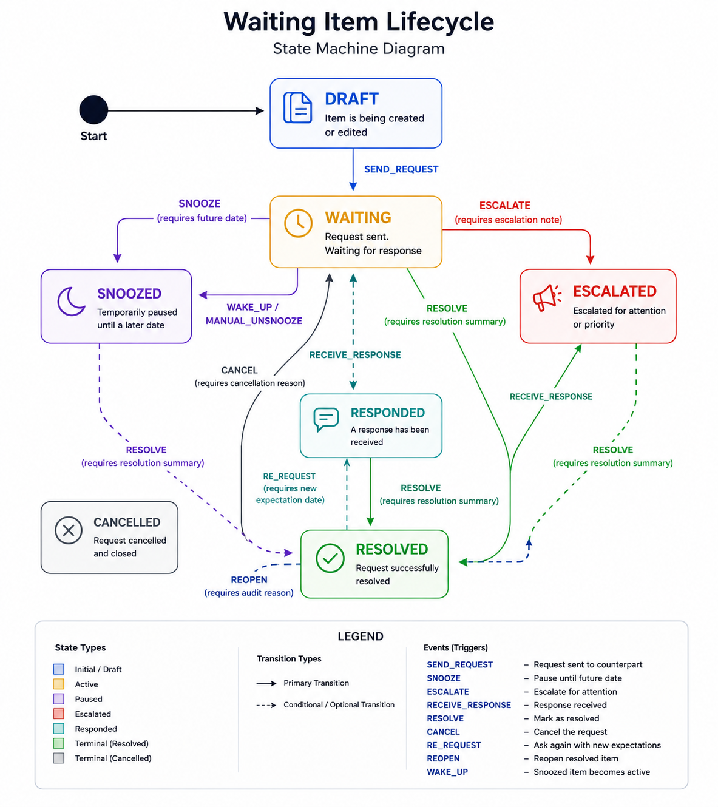

# WaitingRoom Architecture & Technical Design Document

## 1. System Overview

**WaitingRoom** is a local-first single-user desktop application designed to track, score, and remediate external dependencies and blocker items. Unlike conventional task managers that track items *you* need to perform, WaitingRoom focuses on items you are **waiting on from external parties** (recruiters, professors, administrative bodies, code reviewers, vendors).

  

---

## 2. Core Domain State Machine

Every waiting item progresses through validated state transitions governed by [`src/core/stateMachine.js`](file:///d:/WaitingRoom/src/core/stateMachine.js):

  

---

## 3. Storage Architecture (IndexedDB v1.0)

Data is persisted locally in the client database `WaitingRoomDB` with five normalized object stores:

1. **`waiting_items`**
   - Keys: `id` (UUID)
   - Indexes: `status`, `category`, `counterpartyId`, `blockingScore`, `createdAt`
2. **`counterparties`**
   - Keys: `id` (UUID)
   - Indexes: `name`, `organization`, `email`
3. **`dependencies`**
   - Keys: `id` (UUID)
   - Indexes: `sourceItemId`, `targetItemId`, `type` (`BLOCKS`, `REQUIRES_INPUT_FROM`, `SUPERSEDES`)
4. **`timeline_events`**
   - Keys: `id` (UUID)
   - Indexes: `itemId`, `type`, `createdAt`
5. **`settings`**
   - Keys: `key` (String)

---

## 4. Background Reconciliation Scheduler

The background scheduler ([`src/services/scheduler.js`](file:///d:/WaitingRoom/src/services/scheduler.js)) executes a recurring 60-second cycle:
- Evaluates elapsed business days and SLA margins via `BusinessCalendar`.
- Re-scores all active waiting items and generates fresh explainable factor breakdowns.
- Re-evaluates follow-up recommendations.
- Respects configured Quiet Hours (`21:00` to `08:00`) before emitting toasts or desktop notifications.
